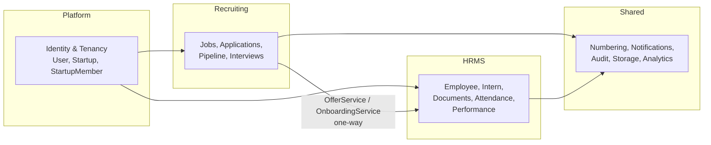
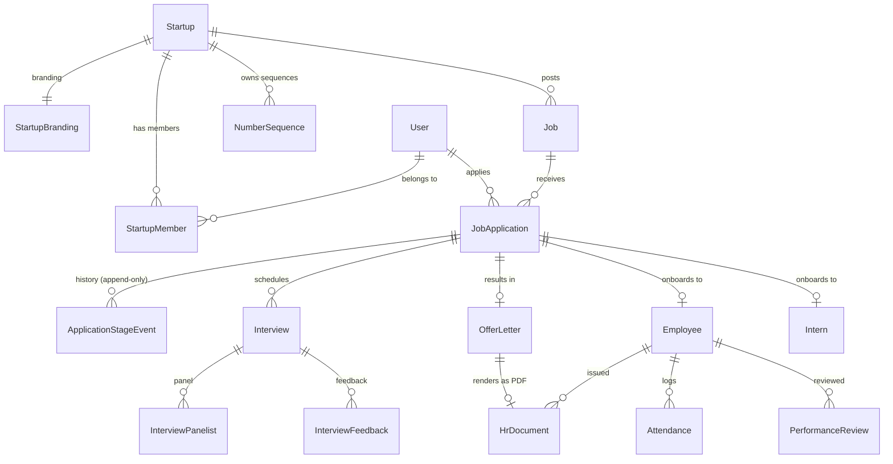
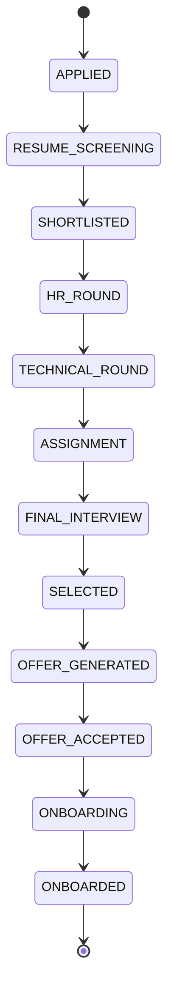

# Multi-Startup Hiring & Recruitment Module — Architecture

**Status:** Draft for approval. No implementation code written yet.
**Author:** Architecture review, 2026-08-03
**Scope:** Extend DevUp Ecosystem with a multi-tenant hiring platform integrated with HRMS.

---

## 0. Finding that changes the brief

The brief instructs: *"We already have a fully functional HRMS. DO NOT redesign it. Reuse it. Do not build another offer letter generator."*

**That HRMS does not exist in this repository.** This was verified against `backend/prisma/schema.prisma` (588 lines, 22 models) and the entire `backend/src` tree:

| Component brief assumes exists | Present? | Evidence |
|---|---|---|
| Employee Management | **No** | No `Employee` model, no employees module |
| Intern Management | **No** | No `Intern` model |
| Offer Letter Generator | **No** | Zero matches for `offer` anywhere in `backend/src` |
| Experience Letter | **No** | No model, no service |
| LOR | **No** | No model, no service |
| Certificates | **No** | No model, no service |
| Attendance | **No** | No model, no service |
| Performance Reviews | **No** | No model, no service |
| ID Cards | **No** | No model, no service |
| Reports / Analytics | **Partial** | Admin `Dashboard.tsx` shows counts only |
| Authentication | **Yes** | Supabase + local JWT fallback, `middleware/auth.ts` |
| Dashboard | **Yes** | Admin portal + student dashboard exist |

The consequence is structural, not cosmetic. "Generate Offer Letter reuses existing HRMS logic" cannot be implemented, because there is no offer letter logic to call. Roughly **60% of this project is building the HRMS**, and the hiring module is the remaining 40% that sits on top of it.

Two options:

- **Option A (recommended).** Build an HRMS core module in the same programme of work, designed as a standalone bounded context that the hiring module consumes through a service interface. The "one generator, reused" principle is preserved architecturally — there is exactly one `OfferLetterService`, owned by HRMS, called by hiring. This is what the rest of this document designs.
- **Option B.** Build hiring only, and stub the HRMS boundary behind interfaces so it can be filled later. Cheaper now, but "Generate Offer Letter" and everything downstream (onboarding → employee/intern, ID cards, certificates) will not function until HRMS lands. The pipeline would dead-end at "Selected".

Everything below assumes **Option A**.

---

## 1. What already exists and is genuinely reusable

Reuse is real here — the foundation is better than the HRMS gap suggests.

| Asset | Location | How it is reused |
|---|---|---|
| `Startup` model | `schema.prisma:107` | Becomes the tenant root. Add `code`, `branding`, `isActive`. |
| `StartupMember` + roles | `schema.prisma:171` | Already a per-tenant membership table with `OWNER/ADMIN/MEMBER` and `ACTIVE/INVITED` status, unique on `(startupId, email)`, indexed on `(userId, startupId)`. This is the multi-tenancy backbone. Extend the role enum. |
| `Job` + `JobApplication` | `schema.prisma:228,258` | Extended, not replaced. `JobApplication` already has `@@unique([jobId, userId])` which prevents duplicate applications. |
| `AuditLog` | `schema.prisma:508` | Extend with `startupId`, `actorId`, `ip`. Reuse the table. |
| `Notification` | `schema.prisma:494` | Reuse as the in-app channel. |
| `Document` + Supabase Storage | `schema.prisma:457`, `lib/storage` | Reuse for resumes and generated PDFs. |
| RBAC permission map | `middleware/rbac.ts` | Reuse the pattern; extend with tenant-scoped permissions. |
| Resend email | `lib/resend.ts` | Reuse as the email channel. |
| BullMQ queues | `jobs/emailQueue.ts` etc. | **Currently defined but never used — no code calls `.add()`.** This module is their first real consumer. |

### Existing weaknesses this design must fix

**1. Tenant isolation is enforced by hand, per method.** The pattern in `jobs.service.ts:177-197` and `startups.service.ts:92-114` is:

```ts
const job = await prisma.job.findUnique({
  where: { id: jobId },
  include: { startup: { include: { founders: true, members: { where: { userId, status: "ACTIVE" } } } } }
});
const isMember = job.startup.members.some(m => ['OWNER','ADMIN'].includes(m.role));
if (role !== "ADMIN" && !isMember && !isLegacyFounder) throw new AppError(403, ...);
```

It is correct where present. The problem is that it is copy-pasted, and correctness depends on every future developer remembering it on every new endpoint. With ~40 new endpoints in this module, one omission is a cross-tenant data breach — exactly what "startup admins cannot see data from other startups" forbids. **This must be centralised.**

**2. Route guards are global, not tenant-scoped.** `jobs.routes.ts` uses `requireRole(["ADMIN","FOUNDER"])`. A FOUNDER of Zappy satisfies that guard on a request targeting DIA's job. Only the service-layer check stops them. There is no defence in depth.

**3. `JobAppStatus` has 4 states** (`APPLIED, SHORTLISTED, REJECTED, HIRED`) against the 13-stage pipeline required, and there is **no history table** — the brief demands "every stage should maintain complete history, nothing should be deleted."

**4. Role model mismatch.** The brief's 9-level hierarchy mixes platform-level and tenant-level roles. `Role` (platform) and `StartupMemberRole` (tenant) exist but the latter has only 3 values.

---

## 2. Domain model and bounded contexts

Four contexts, deliberately separated so the hiring module never owns HR records and the HRMS never owns pipeline state.



**The critical rule:** Recruiting depends on HRMS through a narrow service interface. HRMS never imports from Recruiting. This keeps "one offer letter generator" true by construction — `OfferLetterService` lives in HRMS and is the only place a letter is produced.

### Lifecycle: the applicant → employee transition

An `Application` and an `Employee` are different entities with different lifetimes. The application is immutable history; the employee is a living HR record. The join happens exactly once, at onboarding:

```
JobApplication (recruiting)  --onboarding-->  Employee | Intern (HRMS)
       stays forever                          new permanent record
       status = ONBOARDED                     employeeId = DUE-ZAP-260001
```

Never mutate an application into an employee. Both persist, linked by `employeeId` on the application.

---

## 3. Multi-tenancy strategy

**Model: shared database, shared schema, discriminator column.** Every tenant-scoped table carries `startupId`. This is the correct choice at your scale (single-digit startups, growing) — schema-per-tenant or DB-per-tenant would multiply migration and connection-pool cost for no benefit, and your Supabase pooler already runs with `connection_limit=1`.

Isolation is enforced at **three layers**. Any one of them failing does not leak data.

### Layer 1 — Route: tenant resolution

Every tenant-scoped route is mounted under `/api/startups/:startupCode/...`. A `resolveTenant` middleware runs once:

```ts
// Pseudocode — middleware/tenant.ts
export const resolveTenant = async (req, res, next) => {
  const { startupCode } = req.params;
  const startup = await prisma.startup.findUnique({ where: { code: startupCode } });
  if (!startup || !startup.isActive) throw new AppError(404, "Startup not found");

  // SUPER_ADMIN may traverse tenants; everyone else must hold membership.
  if (req.user.role !== "SUPER_ADMIN") {
    const membership = await prisma.startupMember.findFirst({
      where: { startupId: startup.id, userId: req.user.id, status: "ACTIVE" }
    });
    if (!membership) throw new AppError(404, "Startup not found"); // 404, not 403 — do not confirm existence
    req.tenantRole = membership.role;
  } else {
    req.tenantRole = "SUPER_ADMIN";
  }
  req.startupId = startup.id;
  next();
};
```

Note the deliberate **404 rather than 403** for non-members. A 403 confirms the startup exists and that you are not in it; 404 reveals nothing. Cross-tenant enumeration is a real risk when tenant codes are short and guessable (`ZAP`, `DIA`).

### Layer 2 — Data: Prisma client extension

Route middleware can be forgotten. This layer cannot be, because it wraps the query engine itself:

```ts
// lib/tenantPrisma.ts
const TENANT_MODELS = new Set([
  "Job", "JobApplication", "ApplicationStageEvent", "Interview",
  "InterviewFeedback", "OfferLetter", "Employee", "Intern",
  "NumberSequence", "StartupBranding", "Attendance", "PerformanceReview"
]);

export function tenantScoped(startupId: string) {
  return prisma.$extends({
    query: {
      $allModels: {
        async $allOperations({ model, operation, args, query }) {
          if (!TENANT_MODELS.has(model)) return query(args);
          if (READ_OPS.has(operation) || WRITE_OPS.has(operation)) {
            args.where = { ...args.where, startupId };   // forced, always
          }
          if (CREATE_OPS.has(operation)) {
            args.data = { ...args.data, startupId };     // forced, ignores body
          }
          return query(args);
        }
      }
    }
  });
}
```

Services receive `req.db` (the scoped client) instead of importing the global `prisma`. A developer who forgets a `where` clause gets tenant-filtered results anyway. **`startupId` is never read from the request body** — only from the validated route parameter.

Lint rule to enforce: services under `modules/recruiting/**` and `modules/hrms/**` may not import the raw `prisma` singleton.

### Layer 3 — Database: Postgres row-level security

Supabase runs Postgres with RLS available. Enable it on tenant tables as a final backstop against a compromised or buggy application layer. Set `app.current_startup_id` per transaction; policies compare against it. This is the layer that protects you if someone writes raw SQL.

---

## 4. Database schema

### 4.1 Changes to existing models

```prisma
model Startup {
  // ... all existing fields unchanged ...
  code           String   @unique   // "ZAP" — immutable, 2..5 uppercase, used in all generated numbers
  isActive       Boolean  @default(true)   // already present
  branding       StartupBranding?
  jobsV2         Job[]
  employees      Employee[]
  interns        Intern[]
  sequences      NumberSequence[]
}

enum StartupMemberRole {
  FOUNDER          // new — was OWNER
  ADMIN
  HR               // new
  RECRUITER        // new
  MANAGER          // new
  EMPLOYEE         // new
  INTERN           // new
  MEMBER           // retained for backward compatibility; migrate to EMPLOYEE
}

model Job {
  // existing: id, startupId, title, description, type, domain, skills,
  //           location, isRemote, stipend, salaryRange, openings, deadline, isActive
  department        String?
  workMode          WorkMode      @default(OFFICE)   // REMOTE | HYBRID | OFFICE
  responsibilities  String[]      @default([])
  requiredSkills    String[]      @default([])
  preferredSkills   String[]      @default([])
  durationMonths    Int?
  status            JobStatus     @default(DRAFT)    // DRAFT|OPEN|PAUSED|CLOSED|FILLED
  hiringManagerId   String?
  hiringManager     User?         @relation("JobHiringManager", fields: [hiringManagerId], references: [id])
  publishedAt       DateTime?
  closedAt          DateTime?

  @@index([startupId, status])
  @@index([startupId, createdAt])
}

model JobApplication {
  // existing: id, jobId, userId, resumeUrl, coverLetter, status,
  //           applicantName, applicantEmail, applicantPhone, @@unique([jobId, userId])
  startupId       String        // denormalised for tenant scoping + index efficiency
  applicationNo   String   @unique          // APP-ZAP-000001
  stage           PipelineStage @default(APPLIED)
  outcome         Outcome?                  // null while in flight
  portfolioUrl    String?
  githubUrl       String?
  linkedinUrl     String?
  skills          String[] @default([])
  college         String?
  cgpa            Decimal? @db.Decimal(4,2)
  experienceYears Decimal? @db.Decimal(4,1)
  rejectionReason String?
  withdrawnAt     DateTime?
  employeeId      String?                   // set at onboarding
  version         Int      @default(0)      // optimistic lock for stage transitions

  events          ApplicationStageEvent[]
  interviews      Interview[]
  offer           OfferLetter?

  @@index([startupId, stage])
  @@index([startupId, appliedAt])
  @@index([userId])
}
```

### 4.2 New models — recruiting

```prisma
enum PipelineStage {
  APPLIED
  RESUME_SCREENING
  SHORTLISTED
  HR_ROUND
  TECHNICAL_ROUND
  ASSIGNMENT
  FINAL_INTERVIEW
  SELECTED
  OFFER_GENERATED
  OFFER_ACCEPTED
  ONBOARDING
  ONBOARDED
}

enum Outcome { REJECTED  WITHDRAWN  OFFER_DECLINED  OFFER_REVOKED  HIRED }

/// Append-only. Never updated, never deleted. Source of truth for pipeline history.
model ApplicationStageEvent {
  id             String        @id @default(uuid())
  startupId      String
  applicationId  String
  application    JobApplication @relation(fields: [applicationId], references: [id], onDelete: Restrict)
  fromStage      PipelineStage?
  toStage        PipelineStage
  outcome        Outcome?
  note           String?
  actorId        String?
  actor          User?         @relation(fields: [actorId], references: [id])
  createdAt      DateTime      @default(now())

  @@index([applicationId, createdAt])
  @@index([startupId, toStage, createdAt])
}

model Interview {
  id             String   @id @default(uuid())
  startupId      String
  applicationId  String
  application    JobApplication @relation(fields: [applicationId], references: [id], onDelete: Cascade)
  stage          PipelineStage
  scheduledAt    DateTime
  durationMins   Int      @default(45)
  timezone       String   @default("Asia/Kolkata")
  mode           String   @default("ONLINE")
  meetingUrl     String?
  status         InterviewStatus @default(SCHEDULED)
  rescheduledFromId String?
  createdBy      String
  panel          InterviewPanelist[]
  feedback       InterviewFeedback[]

  @@index([startupId, scheduledAt])
  @@index([applicationId])
}

enum InterviewStatus { SCHEDULED  COMPLETED  CANCELLED  NO_SHOW  RESCHEDULED }

model InterviewPanelist {
  id           String    @id @default(uuid())
  interviewId  String
  interview    Interview @relation(fields: [interviewId], references: [id], onDelete: Cascade)
  userId       String
  @@unique([interviewId, userId])
}

model InterviewFeedback {
  id           String    @id @default(uuid())
  startupId    String
  interviewId  String
  interview    Interview @relation(fields: [interviewId], references: [id], onDelete: Cascade)
  reviewerId   String
  rating       Int       // 1..5
  recommend    Recommendation
  strengths    String?
  concerns     String?
  notes        String?
  createdAt    DateTime  @default(now())

  @@unique([interviewId, reviewerId])   // one feedback per reviewer per interview
}

enum Recommendation { STRONG_YES  YES  NEUTRAL  NO  STRONG_NO }
```

### 4.3 New models — HRMS core

```prisma
model StartupBranding {
  id                String  @id @default(uuid())
  startupId         String  @unique
  startup           Startup @relation(fields: [startupId], references: [id], onDelete: Cascade)
  legalName         String
  addressLine1      String
  addressLine2      String?
  city              String
  state             String
  pincode           String
  logoUrl           String?
  signatoryName     String
  signatoryTitle    String
  signatureImageUrl String?
  letterheadUrl     String?
  primaryColor      String? @default("#c8f135")
}

model Employee {
  id             String   @id @default(uuid())
  startupId      String
  employeeCode   String   @unique          // DUE-ZAP-260001 — permanent, never changes
  userId         String?
  applicationId  String?  @unique          // provenance back to recruiting
  fullName       String
  email          String
  phone          String?
  department     String?
  designation    String
  employmentType JobType
  status         EmploymentStatus @default(ACTIVE)
  joinedAt       DateTime
  exitedAt       DateTime?
  managerId      String?
  ctc            String?

  documents      HrDocument[]
  attendance     Attendance[]
  reviews        PerformanceReview[]

  @@unique([startupId, email])
  @@index([startupId, status])
}

enum EmploymentStatus { ACTIVE  NOTICE  EXITED  TERMINATED }

/// Interns are modelled separately: fixed duration, stipend, college linkage,
/// and they receive certificates rather than experience letters.
model Intern {
  id            String   @id @default(uuid())
  startupId     String
  internCode    String   @unique          // DUI-ZAP-260001
  userId        String?
  applicationId String?  @unique
  fullName      String
  email         String
  college       String?
  mentorId      String?
  stipend       String?
  startDate     DateTime
  endDate       DateTime
  status        EmploymentStatus @default(ACTIVE)

  @@unique([startupId, email])
}

enum HrDocType { OFFER_LETTER  EXPERIENCE_LETTER  LOR  CERTIFICATE  ID_CARD  RELIEVING }

/// One table for every generated HR document. One generator, many types.
model HrDocument {
  id            String    @id @default(uuid())
  startupId     String
  docType       HrDocType
  documentNo    String    @unique         // DEVUP/ZAP/OL/2026-27/0001
  employeeId    String?
  employee      Employee? @relation(fields: [employeeId], references: [id])
  internId      String?
  applicationId String?
  templateKey   String
  payload       Json                      // frozen snapshot of merge fields at issue time
  pdfUrl        String?
  issuedAt      DateTime  @default(now())
  issuedBy      String
  revokedAt     DateTime?
  revokeReason  String?

  @@index([startupId, docType, issuedAt])
}

/// OfferLetter is the recruiting-facing view; the PDF itself is an HrDocument.
model OfferLetter {
  id             String   @id @default(uuid())
  startupId      String
  applicationId  String   @unique
  application    JobApplication @relation(fields: [applicationId], references: [id])
  hrDocumentId   String?  @unique
  offerNo        String   @unique         // DEVUP/ZAP/OL/2026-27/0001
  designation    String
  ctc            String?
  stipend        String?
  joiningDate    DateTime
  expiresAt      DateTime
  status         OfferStatus @default(DRAFT)
  acceptedAt     DateTime?
  declinedAt     DateTime?
  declineReason  String?
  revokedAt      DateTime?
}

enum OfferStatus { DRAFT  SENT  ACCEPTED  DECLINED  EXPIRED  REVOKED }

model Attendance {
  id         String   @id @default(uuid())
  startupId  String
  employeeId String
  employee   Employee @relation(fields: [employeeId], references: [id], onDelete: Cascade)
  date       DateTime @db.Date
  status     String   // PRESENT | ABSENT | HALF_DAY | LEAVE | HOLIDAY
  checkIn    DateTime?
  checkOut   DateTime?
  @@unique([employeeId, date])
  @@index([startupId, date])
}

model PerformanceReview {
  id          String   @id @default(uuid())
  startupId   String
  employeeId  String
  employee    Employee @relation(fields: [employeeId], references: [id], onDelete: Cascade)
  periodStart DateTime
  periodEnd   DateTime
  reviewerId  String
  rating      Int
  strengths   String?
  improvements String?
  goals       String?
  status      String   @default("DRAFT")
  @@index([startupId, employeeId])
}
```

### 4.4 Numbering — the concurrency-critical piece

Four independent per-tenant sequences are required, and the obvious implementation is wrong.

**Do not use `count() + 1`.** Two applications submitted in the same millisecond both read `count = 41` and both write `APP-ZAP-000042`. Under load this is not rare, it is guaranteed.

```prisma
model NumberSequence {
  id        String @id @default(uuid())
  startupId String
  kind      String   // APPLICATION | OFFER | EMPLOYEE | INTERN
  period    String   // "2026-27" for fiscal-year-scoped kinds, "*" for perpetual
  current   Int      @default(0)

  @@unique([startupId, kind, period])
}
```

Allocation is an atomic single-statement increment inside the caller's transaction:

```ts
async function nextNumber(tx, startupId, kind, period) {
  const seq = await tx.numberSequence.upsert({
    where:  { startupId_kind_period: { startupId, kind, period } },
    create: { startupId, kind, period, current: 1 },
    update: { current: { increment: 1 } },   // atomic at the DB, not read-then-write
    select: { current: true }
  });
  return seq.current;
}
```

`update: { increment: 1 }` compiles to `SET current = current + 1` — the database serialises concurrent writers on the row. The `@unique` constraint on every generated number (`applicationNo`, `offerNo`, `employeeCode`) is the backstop: if a bug ever produces a duplicate, the insert fails loudly instead of silently corrupting records.

Formats:

| Kind | Format | Example | Scope |
|---|---|---|---|
| Application | `APP-{CODE}-{seq:6}` | `APP-ZAP-000001` | perpetual per startup |
| Offer | `DEVUP/{CODE}/OL/{FY}/{seq:4}` | `DEVUP/ZAP/OL/2026-27/0001` | resets each fiscal year |
| Employee | `DUE-{CODE}-{YY}{seq:4}` | `DUE-ZAP-260001` | perpetual, permanent |
| Intern | `DUI-{CODE}-{YY}{seq:4}` | `DUI-ZAP-260001` | perpetual, permanent |

Indian fiscal year runs April–March, so `2026-27` begins 2026-04-01. A helper `fiscalYear(date)` must own this; do not inline the arithmetic. **Numbers are allocated only at the moment of commitment** (application submitted, offer generated, candidate onboarded) — never on draft creation, or gaps appear in the sequence and startups will ask why.

---

## 5. Entity relationships



---

## 6. Pipeline state machine

The pipeline is a state machine, not a free-text status field. Illegal transitions must be rejected by the service, not merely discouraged by the UI.



Rules:

- **Forward transitions** follow the order above. Stages `ASSIGNMENT` and `TECHNICAL_ROUND` are **skippable** — not every role needs them. Configure per job via `Job.pipelineTemplate` (a `PipelineStage[]`); the state machine validates against that job's template, not the global enum.
- **Rejection is available from any stage** before `ONBOARDED`, and sets `outcome = REJECTED`. It is terminal.
- **Withdrawal** is candidate-initiated, available any time before `ONBOARDED`, sets `outcome = WITHDRAWN`.
- **Backward transitions are permitted but logged loudly** (e.g. `FINAL_INTERVIEW → TECHNICAL_ROUND` when a panel wants another round). Restricted to `HR` and above.
- **`OFFER_GENERATED → SELECTED` is forbidden.** Once a numbered offer exists, the sequence is consumed. Use revoke instead, which is auditable.
- **Every transition writes an `ApplicationStageEvent`.** `JobApplication.stage` is a denormalised cache of the latest event for query speed; the event log is the source of truth. If they ever disagree, the log wins.

**Concurrency.** Two recruiters acting on one candidate simultaneously will both read `stage = HR_ROUND` and both write. `JobApplication.version` provides optimistic locking: the update is `where: { id, version: n }, data: { version: { increment: 1 }, ... }`. A zero-row result means someone else moved first — return `409 Conflict` and have the UI refetch. Silent last-write-wins here means a rejected candidate quietly becomes shortlisted.

---

## 7. Permission matrix

Two orthogonal dimensions, which the brief's flat list conflates:

- **Platform role** (`User.role`) — who you are on DevUp. Governs cross-tenant reach.
- **Tenant role** (`StartupMember.role`) — what you may do *inside one startup*. Governs everything else.

An Applicant is not a tenant member at all — they are a platform `STUDENT` with no `StartupMember` row. This is why applicants cannot leak into tenant queries: they have no membership to resolve.

| Action | SUPER_ADMIN | FOUNDER | ADMIN | HR | RECRUITER | MANAGER | EMPLOYEE | INTERN | Applicant |
|---|---|---|---|---|---|---|---|---|---|
| View all startups | ✅ | ❌ | ❌ | ❌ | ❌ | ❌ | ❌ | ❌ | ❌ |
| Platform analytics | ✅ | ❌ | ❌ | ❌ | ❌ | ❌ | ❌ | ❌ | ❌ |
| Manage startup settings | ✅ | ✅ | ✅ | ❌ | ❌ | ❌ | ❌ | ❌ | ❌ |
| Manage branding | ✅ | ✅ | ✅ | ❌ | ❌ | ❌ | ❌ | ❌ | ❌ |
| Invite / remove members | ✅ | ✅ | ✅ | ❌ | ❌ | ❌ | ❌ | ❌ | ❌ |
| Create / edit job | ✅ | ✅ | ✅ | ✅ | ✅ | ❌ | ❌ | ❌ | ❌ |
| Publish / close job | ✅ | ✅ | ✅ | ✅ | ❌ | ❌ | ❌ | ❌ | ❌ |
| View applicants | ✅ | ✅ | ✅ | ✅ | ✅ | ✅¹ | ❌ | ❌ | ❌ |
| Advance / reject candidate | ✅ | ✅ | ✅ | ✅ | ✅ | ❌ | ❌ | ❌ | ❌ |
| Schedule interview | ✅ | ✅ | ✅ | ✅ | ✅ | ❌ | ❌ | ❌ | ❌ |
| Submit interview feedback | ✅ | ✅ | ✅ | ✅ | ✅ | ✅¹ | ❌ | ❌ | ❌ |
| **Generate offer letter** | ✅ | ✅ | ✅ | ✅ | ❌ | ❌ | ❌ | ❌ | ❌ |
| Revoke offer | ✅ | ✅ | ✅ | ❌ | ❌ | ❌ | ❌ | ❌ | ❌ |
| Onboard → employee | ✅ | ✅ | ✅ | ✅ | ❌ | ❌ | ❌ | ❌ | ❌ |
| View employee records | ✅ | ✅ | ✅ | ✅ | ❌ | ✅¹ | own | own | ❌ |
| Issue certificate / LOR | ✅ | ✅ | ✅ | ✅ | ❌ | ❌ | ❌ | ❌ | ❌ |
| Mark attendance | ✅ | ✅ | ✅ | ✅ | ❌ | ✅¹ | own | own | ❌ |
| Write performance review | ✅ | ✅ | ✅ | ✅ | ❌ | ✅¹ | ❌ | ❌ | ❌ |
| Browse jobs / apply | ✅ | ✅ | ✅ | ✅ | ✅ | ✅ | ✅ | ✅ | ✅ |
| View own applications | — | — | — | — | — | — | — | — | ✅ |

¹ Scoped to their own team / direct reports only — enforced by an additional `managerId` predicate, not by role alone.

**Deliberate restrictions.** Offer generation is HR-and-above because it consumes a fiscal-year sequence number and creates a legally meaningful document; a Recruiter who can advance candidates should not be able to bind the company. Offer *revocation* is Admin-and-above because it has contractual consequences.

**Privilege escalation guard.** A member may never grant a role higher than their own, and never change their own role. `FOUNDER` is assignable only by `SUPER_ADMIN`. Without this, any ADMIN promotes themselves to FOUNDER.

---

## 8. API architecture

RESTful, tenant-scoped by path. The path segment makes the tenant explicit in every log line, metric, and cache key.

```
# ── Public / student ───────────────────────────────
GET    /api/jobs                              # all open jobs, all startups, filterable
GET    /api/jobs/:id
POST   /api/jobs/:id/apply                    # multipart: resume + fields
GET    /api/me/applications                   # own applications, all startups
GET    /api/me/applications/:id               # own only — ownership check, not tenant check
POST   /api/me/applications/:id/withdraw
POST   /api/me/offers/:id/accept
POST   /api/me/offers/:id/decline

# ── Tenant-scoped (resolveTenant + requireTenantRole) ──
GET    /api/startups/:code/dashboard
GET    /api/startups/:code/jobs
POST   /api/startups/:code/jobs
PATCH  /api/startups/:code/jobs/:jobId
POST   /api/startups/:code/jobs/:jobId/publish
POST   /api/startups/:code/jobs/:jobId/close

GET    /api/startups/:code/applications        # ?stage=&jobId=&college=&q=
GET    /api/startups/:code/applications/:id
POST   /api/startups/:code/applications/:id/transition   # { toStage, note, version }
POST   /api/startups/:code/applications/:id/reject       # { reason, version }
POST   /api/startups/:code/applications/bulk-transition  # queued when count > 50

POST   /api/startups/:code/applications/:id/interviews
PATCH  /api/startups/:code/interviews/:id
POST   /api/startups/:code/interviews/:id/feedback

POST   /api/startups/:code/applications/:id/offer         # generate — idempotent
POST   /api/startups/:code/offers/:id/send
POST   /api/startups/:code/offers/:id/revoke
POST   /api/startups/:code/applications/:id/onboard       # → Employee | Intern

GET    /api/startups/:code/employees
GET    /api/startups/:code/interns
POST   /api/startups/:code/employees/:id/documents        # LOR, certificate, experience letter
GET    /api/startups/:code/analytics
PUT    /api/startups/:code/branding

# ── Super admin ────────────────────────────────────
GET    /api/admin/overview
GET    /api/admin/startups/comparison
GET    /api/admin/analytics/funnel
GET    /api/admin/analytics/colleges
GET    /api/admin/audit
```

**Idempotency.** `POST .../offer` must be idempotent — a double-click must not consume two sequence numbers. Enforced by the `@unique` on `OfferLetter.applicationId`: the second call returns the existing offer with `200` rather than creating another. Mutating endpoints accept an optional `Idempotency-Key` header.

**Response envelope** matches the existing convention (`{ success, data }` / `{ success, error, code }`) so the frontend `api` client and admin `axios` instance need no changes.

---

## 9. Folder structure

Follows the existing `modules/<domain>/{routes,controller,service,schema}.ts` convention exactly.

```
backend/src/
  middleware/
    tenant.ts                    # NEW resolveTenant, requireTenantRole
  lib/
    tenantPrisma.ts              # NEW scoped client extension
    numbering.ts                 # NEW sequence allocation + fiscal year
    pdf/                         # NEW renderer + templates
  modules/
    recruiting/
      jobs/          { routes, controller, service, schema }.ts
      applications/  { routes, controller, service, schema }.ts
      pipeline/      pipeline.service.ts        # state machine — the only writer of stage
      interviews/    { routes, controller, service, schema }.ts
      offers/        { routes, controller, service }.ts   # orchestrates, delegates render to hrms
    hrms/
      employees/     { routes, controller, service }.ts
      interns/       { routes, controller, service }.ts
      documents/     document.service.ts        # THE generator — offer, LOR, cert, experience
      templates/     offerLetter.tsx, certificate.tsx, ...
      attendance/    { routes, controller, service }.ts
      performance/   { routes, controller, service }.ts
    analytics/
      tenant.service.ts
      platform.service.ts
    shared/
      audit.service.ts
      notification.service.ts

frontend/app/
  (startup)/s/[code]/            # NEW startup workspace
    dashboard/ jobs/ applications/ interviews/ offers/ employees/ interns/
    analytics/ settings/
  dashboard/applications/        # student: my applications (extend existing)
  (admin)/admin/                 # extend existing super-admin
```

---

## 10. Key flows

### 10.1 Student applies

```mermaid
sequenceDiagram
  participant S as Student
  participant API
  participant DB
  participant Q as Queue
  S->>API: POST /api/jobs/:id/apply (resume, fields)
  API->>API: validate; job.status == OPEN; deadline not passed
  API->>DB: BEGIN
  DB-->>API: unique(jobId,userId) → 409 if duplicate
  API->>DB: nextNumber(startupId,'APPLICATION','*') → APP-ZAP-000042
  API->>DB: upload resume → Storage; insert JobApplication
  API->>DB: insert ApplicationStageEvent(null → APPLIED)
  API->>DB: insert AuditLog
  API->>DB: COMMIT
  API->>Q: enqueue notify(student) + notify(hiring team)
  API-->>S: 201 { applicationNo }
```

Note the resume upload sits inside the transaction boundary conceptually but must be executed **before** `COMMIT` and cleaned up on rollback — Supabase Storage is not transactional. Upload first to a temp path, commit, then finalise; a nightly sweeper removes orphans.

### 10.2 Offer generation → onboarding

```mermaid
sequenceDiagram
  participant HR
  participant Rec as Recruiting
  participant HRMS
  participant Q as Queue
  HR->>Rec: POST /applications/:id/offer
  Rec->>Rec: assert stage == SELECTED; assert no existing offer
  Rec->>HRMS: OfferLetterService.generate(application, branding)
  HRMS->>HRMS: nextNumber(OFFER, fiscalYear) → DEVUP/ZAP/OL/2026-27/0001
  HRMS->>HRMS: render template + startup branding → PDF
  HRMS-->>Rec: { offerNo, hrDocumentId, pdfUrl }
  Rec->>Rec: transition SELECTED → OFFER_GENERATED (+ event)
  Rec->>Q: email offer to candidate
  Note over HR,Q: candidate accepts
  Rec->>Rec: OFFER_GENERATED → OFFER_ACCEPTED
  HR->>Rec: POST /applications/:id/onboard
  Rec->>HRMS: OnboardingService.create(application)
  HRMS->>HRMS: nextNumber(EMPLOYEE) → DUE-ZAP-260001
  HRMS->>HRMS: create Employee; StartupMember(role=EMPLOYEE)
  Rec->>Rec: transition → ONBOARDED, outcome=HIRED
```

The single arrow from Recruiting to HRMS is the whole "reuse, don't rebuild" contract. `OfferLetterService.generate` is the only function in the system that produces an offer letter.

---

## 11. Validation rules

| Rule | Enforced where |
|---|---|
| `Startup.code` — `^[A-Z]{2,5}$`, unique, immutable after creation | Zod + DB unique + service guard |
| Application requires resume; ≤ 5 MB; PDF/DOC/DOCX only | Zod + multer limits (`MAX_FILE_SIZE_MB` already configured) |
| CGPA 0–10, two decimals | Zod |
| Cannot apply to a job that is not `OPEN` or past `deadline` | Service |
| Cannot apply twice | `@@unique([jobId, userId])` |
| Stage transition must be legal for that job's template | `pipeline.service` |
| Transition requires matching `version` | Optimistic lock |
| Offer requires `stage == SELECTED` and branding configured | Service |
| Offer `joiningDate` ≥ today; `expiresAt` > now | Zod + service |
| Onboarding requires `OFFER_ACCEPTED` | Service |
| Interview `scheduledAt` in future; panel members belong to the tenant | Service |
| One feedback per reviewer per interview | `@@unique([interviewId, reviewerId])` |
| Cannot close a job with candidates in flight without explicit confirmation | Service, returns `409` with count |

---

## 12. Security rules

1. **`startupId` is never accepted from a request body.** Only from the validated `:code` route param. This single rule prevents the most likely cross-tenant write.
2. **404, not 403,** for non-member access to a tenant resource — no existence disclosure.
3. **Three isolation layers** (route, Prisma extension, RLS) — see §3.
4. **Resumes are private objects.** Served via short-lived signed URLs (15 min), never public bucket paths. A leaked permanent URL is a PII breach.
5. **Applicant PII is visible only to the startup applied to.** Super Admin analytics see **aggregates**, not resumes — the dashboard spec asks for counts and rates, which do not require row-level PII.
6. **Privilege escalation guard** — §7.
7. **Audit log is append-only.** No update or delete endpoint. Retention ≥ 7 years for offer and employment events.
8. **Rate limits:** application submission 10/hour/user; offer generation 50/day/tenant. The existing `rateLimit.ts` in-memory store is per-process — this needs Redis before multi-instance deploy.
9. **Offer acceptance tokens** are single-use, expiring, and bound to the application; never a guessable ID in a URL.
10. **Soft-delete only** for tenant data. Startups deactivate (`isActive = false`); records are never hard-deleted, because employment history is a legal record.

---

## 13. Edge cases

**Identity and multi-tenancy**
- One student applies to Zappy and DIA — two applications, two numbers, mutually invisible. Handled by tenant scoping.
- An employee at Zappy applies to DIA — legitimate. Their `StartupMember(EMPLOYEE, Zappy)` must not grant any DIA visibility, and DIA must not see their Zappy record.
- A user is HR at Zappy and a MANAGER at DIA — tenant role must be resolved per request, never cached globally in the session. This is a common source of bugs.
- Startup is deactivated with employees and open jobs — jobs unpublish, applications freeze, employee records persist read-only.

**Pipeline**
- Two recruiters transition simultaneously → optimistic lock, `409`.
- Candidate withdraws after offer generated → offer auto-revoked, sequence number stays consumed (gaps are correct and auditable).
- Job closed with 30 candidates mid-pipeline → block with `409` and a count; require explicit `?force=true` which bulk-rejects with a reason.
- Offer expires with no response → nightly job sets `EXPIRED`; candidate returns to `SELECTED` for a re-offer decision.
- Candidate accepts, never joins → `Offer.ACCEPTED` but no onboarding; needs a `NO_SHOW` outcome and a reminder after `joiningDate`.
- Rehire of a former employee → **reuse the original `employeeCode`**. The brief says permanent; a second code for the same person breaks that promise and corrupts tenure reporting.

**Numbering**
- Concurrent submissions → atomic increment (§4.4).
- Fiscal-year rollover at midnight 31 Mar → `fiscalYear()` computed inside the transaction, not passed in from a stale request.
- Startup code changed after issuance → **forbidden**. Historical documents would no longer match their numbers.

**Documents**
- Branding missing when generating an offer → hard-fail with a clear message rather than emitting an unbranded letter.
- Offer regenerated after a salary correction → supersede: revoke old (retained), issue new number, link `supersedesId`. Never mutate an issued document; the `payload` snapshot exists precisely so a reissued letter can be compared with the original.

**Scale**
- Bulk reject of 500 applicants → queue it; do not fan out 500 emails in a request cycle.
- A viral job post → application spike; rate limit plus queued notifications.

---

## 14. Scalability concerns

**Analytics is the first thing that will break.** The Super Admin dashboard specifies 20 metrics across all startups. Computed live with `count()` per metric, that is 20+ full scans on every page load. At 10k applications it is slow; at 100k it times out.

Design for it now: a `TenantMetricsDaily` rollup table written by a nightly job plus incremental updates on stage transitions. Dashboards read the rollup; only drill-downs hit source tables. Funnel conversion, college distribution, and monthly trends are all derivable from `ApplicationStageEvent` aggregated by day — which is exactly why the event log is append-only.

**The queues already exist and are unused.** `emailQueue`, `aiQueue`, `documentQueue` are defined in `backend/src/jobs/` but **no code anywhere calls `.add()`**. This module is their first genuine consumer: notification fan-out, PDF rendering, bulk transitions, nightly rollups. Note that Redis is currently disabled (`REDIS_ENABLED=false`) — it must be enabled and pointed at real Upstash before this module ships, otherwise every queued job silently no-ops.

**Indexing.** Every tenant query filters on `startupId` first, so composite indexes must lead with it: `(startupId, stage)`, `(startupId, appliedAt)`, `(startupId, status)`. A plain index on `stage` alone is nearly useless here.

**Connection pool.** `DATABASE_URL` currently sets `connection_limit=1` through pgbouncer. That is fine for the present load and wrong for concurrent PDF generation and rollup jobs. Raise it, and run background workers on `DIRECT_URL` so they do not starve request handlers.

**PDF generation is CPU-bound** — never inline in a request. Queue it, store to Supabase Storage, notify when ready.

**N+1 risk** in the pipeline board: 12 columns × N candidates each, with interviews and feedback per card. Use a single grouped query, not per-column fetches.

---

## 15. Proposed phasing

| Phase | Deliverable | Why this order |
|---|---|---|
| **0** | `Startup.code`, `StartupBranding`, tenant middleware, scoped Prisma client, extended roles, RLS | Nothing else is safe to build until isolation is enforced |
| **1** | Numbering service + tests (concurrency test included) | Every later phase depends on correct numbers |
| **2** | Jobs v2 + startup workspace shell | Smallest useful vertical slice |
| **3** | Applications + student apply flow + pipeline state machine + event log | Core recruiting value |
| **4** | Interviews + feedback | Completes the pipeline |
| **5** | HRMS core: Employee, Intern, `HrDocument`, PDF renderer, offer letter | The gap identified in §0 |
| **6** | Offer → acceptance → onboarding | Joins recruiting to HRMS |
| **7** | Notifications on queues, full audit coverage | Cross-cutting, needs real events to fire |
| **8** | Tenant analytics + rollups, Super Admin dashboard | Needs data to be meaningful |
| **9** | Attendance, performance, certificates, LOR, ID cards | Remaining HRMS surface |

Phase 0 is not optional and not deferrable. Retrofitting tenant isolation onto 40 endpoints that already exist is how cross-tenant leaks ship.

---

## 16. Decisions needed before implementation

1. **Option A or B** from §0 — build HRMS core, or stub it? (Recommendation: A.)
2. **Startup codes** — confirm `ZAP`, `DIA`, `ELN`, `YRN`, and note that codes are immutable once a document is issued.
3. **Fiscal year** — confirm April–March (Indian standard) for offer numbering.
4. **`MEMBER` migration** — existing `StartupMember` rows with role `MEMBER` map to `EMPLOYEE`, and `OWNER` maps to `FOUNDER`. Confirm before the migration runs.
5. **Redis** — confirm Upstash will be provisioned for Phase 7, since queues are required for notifications at volume.
